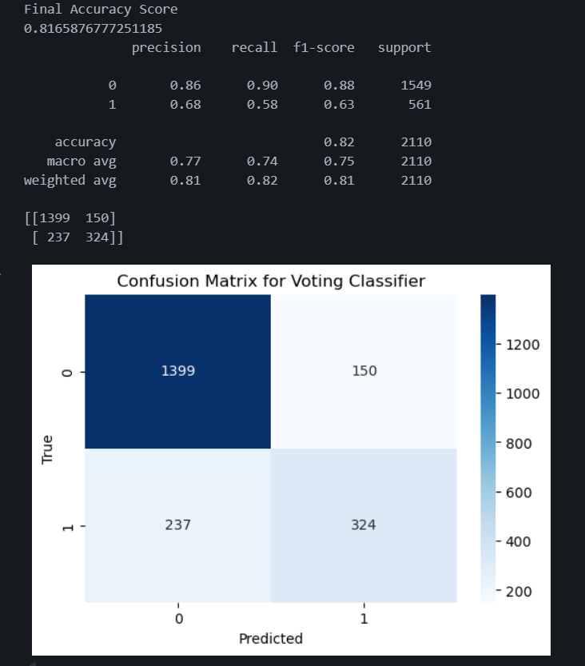
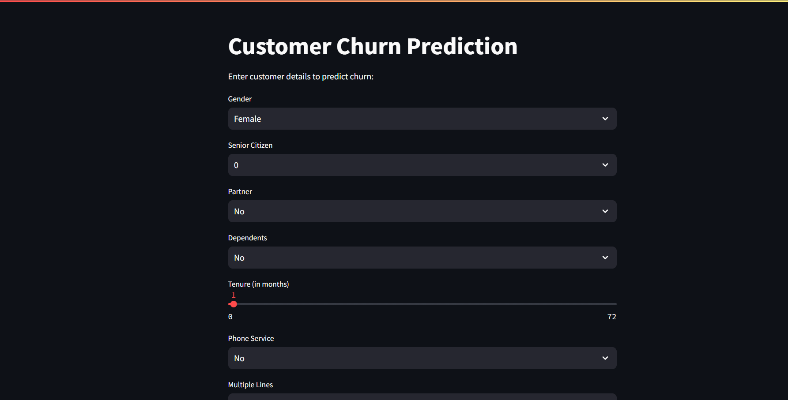
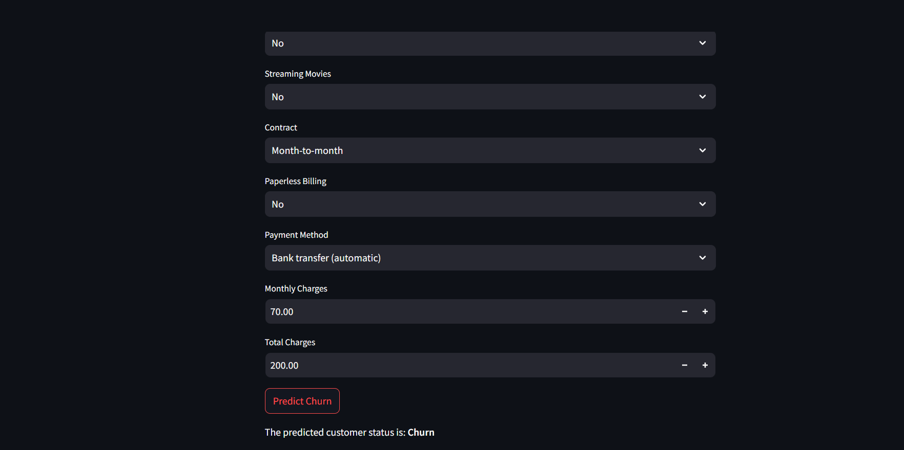

# Customer Churn Prediction

## Project Overview

This project aims to predict customer churn for a telecom company using machine learning models. The dataset contains customer demographics, account information, and service usage details. The goal is to identify customers who are likely to leave the company (churn) and help the business take proactive actions.

---

## Dataset

- **Source:** [WA_Fn-UseC_-Telco-Customer-Churn.csv](https://www.kaggle.com/blastchar/telco-customer-churn)
- **Features:**  
  - Demographics: gender, SeniorCitizen, Partner, Dependents  
  - Services: PhoneService, MultipleLines, InternetService, OnlineSecurity, OnlineBackup, DeviceProtection, TechSupport, StreamingTV, StreamingMovies  
  - Account: tenure, Contract, PaperlessBilling, PaymentMethod, MonthlyCharges, TotalCharges  
  - Target: Churn (Yes/No)

---

## Workflow

1. **Data Cleaning & Preprocessing**
    - Handle missing values and data types
    - Encode categorical features using LabelEncoder
    - Standardize numerical features using StandardScaler

2. **Exploratory Data Analysis**
    - Visualize distributions, correlations, and relationships between features and churn

3. **Modeling**
    - Train multiple models: Logistic Regression, Random Forest, SVM, KNN, AdaBoost, Gradient Boosting, Extra Trees, XGBoost, MLP, Deep Neural Network
    - Use GridSearchCV and Cross Validation to select best hyperparameters
    - Evaluate models using Accuracy, Recall, Precision, F1 Score, ROC Curve

4. **Best Model**
    - The best performing model is a **Voting Classifier** (ensemble of GradientBoosting, LogisticRegression, AdaBoost)
    - Model and scaler are saved using `joblib` for deployment

---

## Deployment with Streamlit

A user-friendly web app is built using [Streamlit](https://streamlit.io/) to allow business users to predict churn for new customers.

### Features

- Enter customer details via interactive widgets
- Model automatically encodes inputs and scales numeric features
- Predicts churn status instantly

### How to Run

1. **Install requirements**
    ```bash
    pip install -r requirements.txt
    ```

2. **Run the app**
    ```bash
    streamlit run deploy.py
    ```

3. **Usage**
    - Fill in customer details in the sidebar/form
    - Click "Predict Churn"
    - The app will display whether the customer is likely to churn or not

---

## Files

- `customer_churn.ipynb` : Main notebook with all analysis, modeling, and evaluation steps
- `deploy.py` : Streamlit app for deployment
- `voting_classifier_model.pkl` : Saved best model
- `scaler.pkl` : Saved scaler for numeric features

---

## Example Screenshots






---

## How Deployment Works

- The app loads the trained model and scaler
- LabelEncoder is fitted on the original data for consistent encoding
- User inputs are encoded and scaled before prediction
- The model outputs churn prediction in real-time

---

## Contact

For questions or suggestions, please open an issue or contact the repo owner.

---

## License

This project is licensed under the MIT License.
